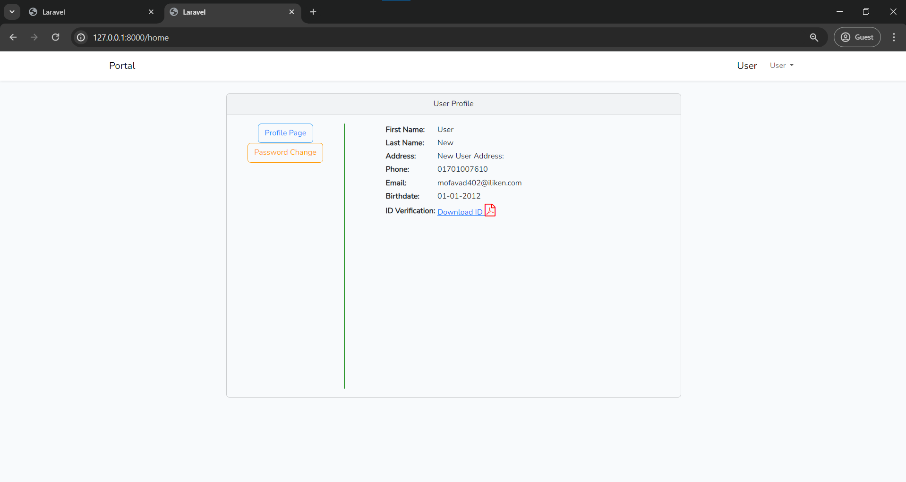
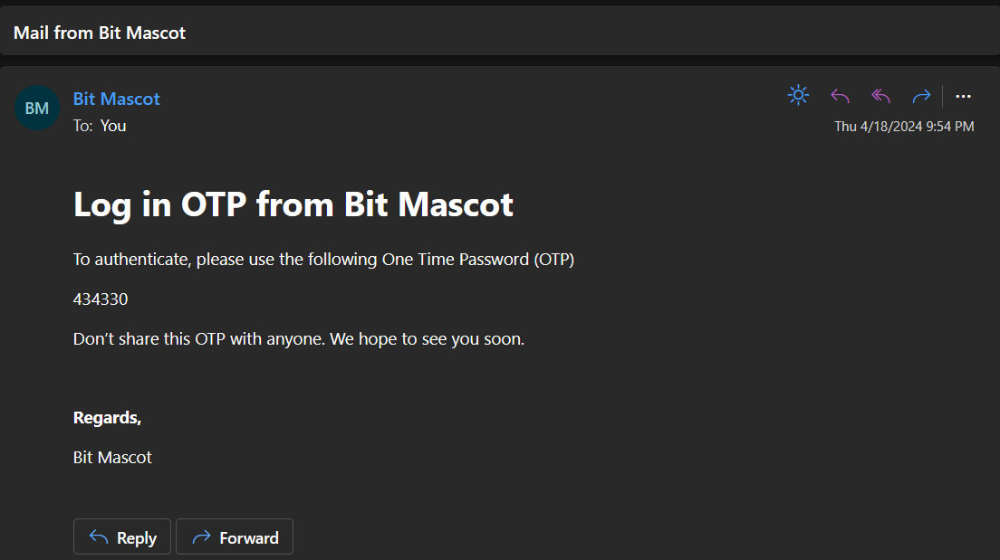

# User Portal
#### Details:
User types:
1. User
2. Admin

<br/>
Admins can see all the users list and download the ID Verification file. Users are allowed to check their details and change the password from the portal.

## Versions
```php
Laravel v11.3.0
PHP v8.2.12
```
## Database
<br/>
MySQL
<br>
``10.4.32-MariaDB``
<br/>
Please find the exported database file in the **db** folder above named as **db_user-portal.sql**
## How to use
* Clone the repository with **git clone**
* Copy .env.example file to .env and edit database credentials there.
* Change the email provider settings as per you credentials
```env
MAIL_MAILER=smtp
MAIL_HOST=smtp.gmail.com
MAIL_PORT=465
MAIL_USERNAME=murad.cs.2017@gmail.com
MAIL_PASSWORD={******}
MAIL_ENCRYPTION=ssl
MAIL_FROM_ADDRESS="murad.cs.2017@gmail.com"
MAIL_FROM_NAME={"Name"}
```
* Run **composer install**
* Run **php artisan key:generate**
* Run this command to start your application
    ```
    php artisan serve   
    ```
* Launch the main URL.

**Log In Page**


**Registration Page**


**New User Registration Verification**
<br />
A new user will get email verification link to his/her email to verify.


<br />


**User Home Page**
<br/> After clicking on the verify link they will be redirected to the home page.



**Log in Verification**
<br/>
Every time when a registered user try to log in, will get a verification code to their email. They need to enter it to log in


**In Log in Code in Email**



**Admin Home Page**


**Change Password**


**Forget Password**


**Forget Password / Reset Password Mail**


**Admin Search Option**


**Solutions for Common Problems**
<br/>
It's better to clear the route and config to avoid any kind of common issues in running the projects
```
php artisan cache:clear 
php artisan config:clear
php artisan route:clear
```
If you make any changes in the libraries or imported something new try to run these command
```
npm install
npm run build
npm run dev
```
